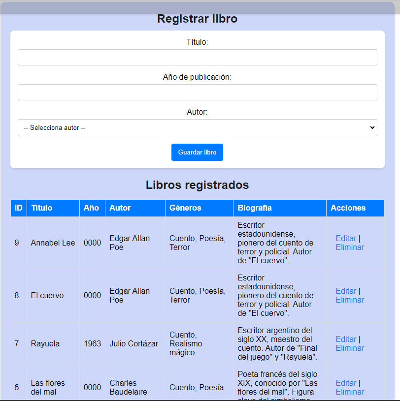
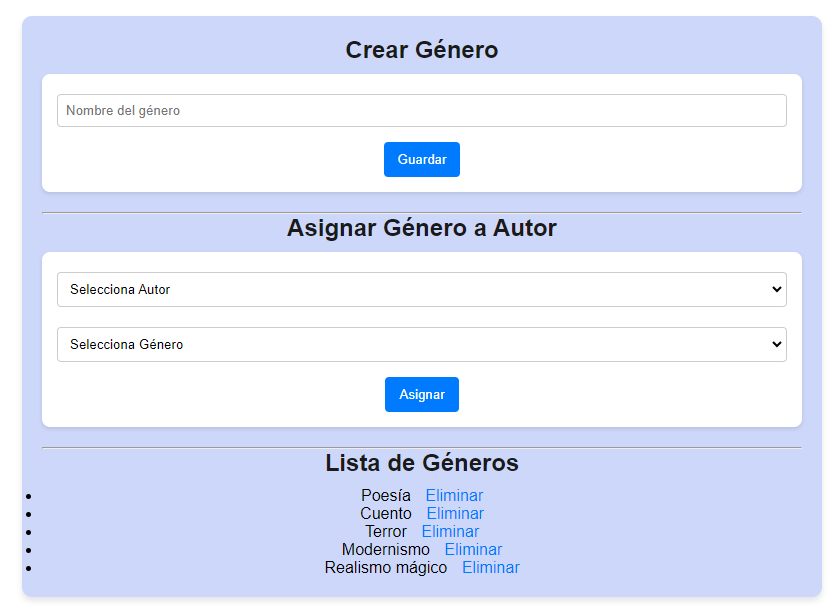

Proyecto Final: Obras literarias

El sistema Web está diseñado pensanndo en una base de datos para una libreria, la página fue diseñada en PHP puro, PDO y MySQL, siguiendo el patrón MV, con el fin de aplicar operaciones CRUD completas con relaciones entre tablas.

El proyecto cumple con todos los requisitos establecidos, incluyendo la implementación de relaciones entre tablas: 
    -   una relación Uno a Uno (1:1) entre Autores y Biografías. 
    -   una relación Uno a Muchos (1:N) entre Autores y Libros.
    -   una relación Muchos a Muchos (N:M) entre Autores y Géneros. 
    
Además, se desarrolló un CRUD completo para cada entidad (Añadir, editar, eliminar), utilizando una conexión a la base de datos mediante PDO. El sistema está estructurado de forma modular. 

ítems de base de datos:

Autes - Priuncipal: Permite crear, editar y elimianr autores.

    - 

Libros - (Relación 1:N): Cada Autor puede tener múltiples libros. 
    - 

Biografías - (Relación 1:1): Cada autor tiene una sola biografía. 
    - 
Géneros literarios - (Relación N:M) Un género puede tener muchos autores. 
    Gestión y asignación de géneros a autores. 
    - 

